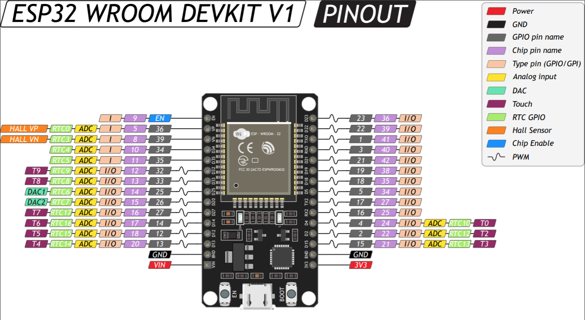

Ham PTT
=======

Bluetooth PTT switch for ham radio transmitters like Baofeng UV-5R.  
Board helps to control transmitter from PC.

Problematic
-----------

Testing of UART interface showed unstable connection. During transmit via UART an usb-ttl 
chip periodically crashes and stops working. Cause is some radio strong interference 
on USB cable. So Bluetooth serial protocol stack chosen instead.

Schematic
---------

Host -> (Bluetooth) -> Esp-32 Arduino -> Relay -> Transmitter PTT button

* Hardware

    - Host PC with Bluetooth (tested Ubuntu 20.04)
    - Esp32 DevKit v1 (or similar esp32)
    - Relay shield
    - Baofeng UV-5R

Examples
--------

- Find BT devices `hcitool scan`
- Python

```python3
from hamptt import open_ptt

with open_ptt(bt_addr="A0:B1:C2:D3:E4:F5") as ptt:
    ptt.begin()
    # I.e. play message to transmitter or something else
    ptt.end()
```

Install
-------

* Host PC machine

    - Python 3.8
    - Bluetooth's libs (required for pybluez)

      ```shell
      sudo apt-get install bluez libbluetooth-dev
      ```

    - Pip
      ```shell
      python3 -m pip install "hamptt[bt]"
      ```


* Esp32

    - Upload sketch to your esp-32 via PlatformIO  
      NOTE! Check your board config in `platformio.ini` (see: https://platformio.org/)
      ```
      pio run -t upload
      ``` 

    - Connect pins Esp-32 to relay

        - VVC -> Relay +
        - GND -> Relay -
        - GPIO D25 -> Relay IN

    - Connect relay and audio, for Baofeng UV-5R it looks like:

        
      NOTE: You can rebuild your hands-free cable or buy another one

Documentation
=============

- Esp32-wroom-devkit-v1 pinout
  

Development
===========

- Build and install
  ```shell
  pip3 uninstall hamptt
  rm -rf dist && poetry build && pip3 install ./dist/*.whl
  ```

Todo
====

- [ ] Push and test package via poetry (+ README.md)

